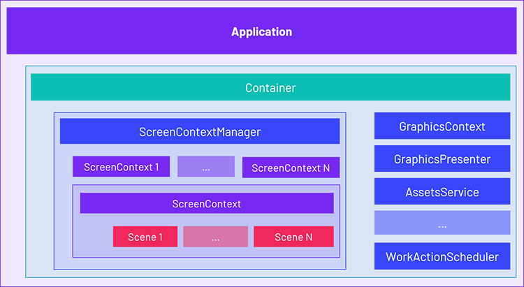

# Application

---

In Evergine, the **Application** class is the entry point for your application. It contains all services and expose the application loop with `DrawFrame()` and `UpdateFrame()` cycles. 

Additionally, it offers the [**Container**](container.md) instance, that allows developer to register all Services and global functionality to be accessed and binded through the entire application (from Components, Scenes, Managers, etc...)

There can be only one instance of Application class in your Evergine project, and we treat it like a Singleton instance

| Static property | Description |
| --- | --- |
| `Application.Current` | **Static property** to access the current Application. It's the most common way to access to your application instance from every part of your Evergine classes. |

## In this section
* [Application Container](container.md)
* [Using Application](using_application.md)