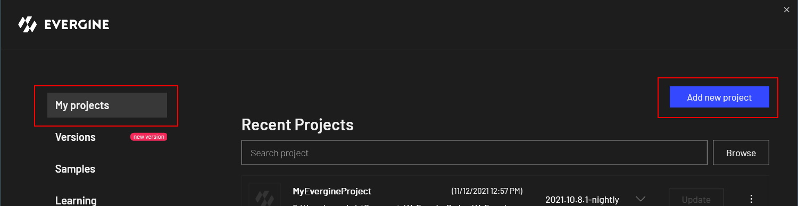
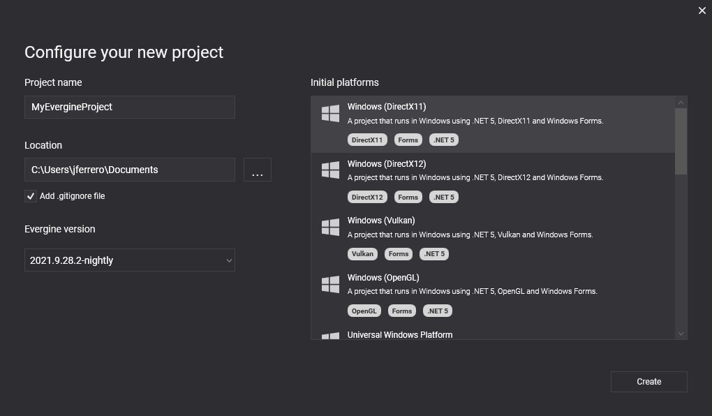

# Create a new project

To create a new project from **Evergine launcher**, go to the _My Projects_ section and click on the _Add new project_ button.

The project configuration windows will be opened. Then you can choose the _Project Name_, the disc location of your project, and the Evergine version to use. Also, you can choose a single or multiples profiles for your project. 

> [!Tip]
> New profiles can be added later

## Open your new Evergine project
Finally, click on the _Create_ button on the bottom right side of the configuration panel to create and open your project in Evergine Studio.

## Next steps

Larn how to [open your Evergine project in Visual Studio](../get_started/open_in_vs.md)