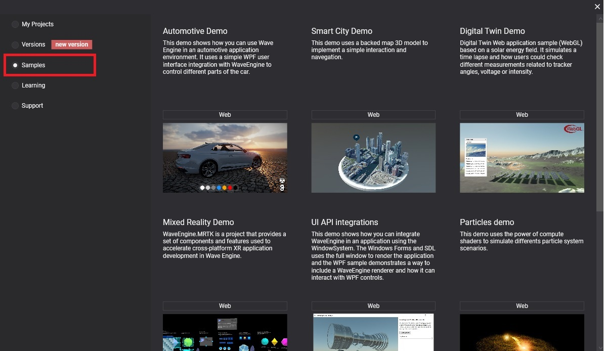
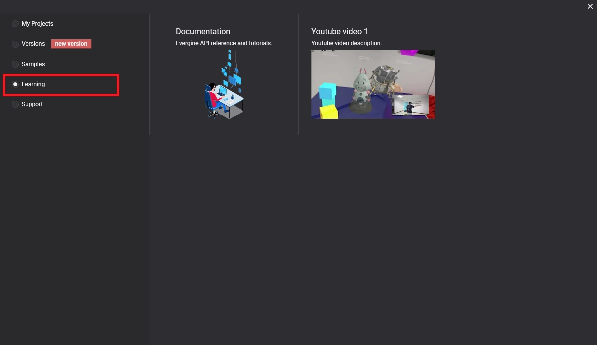
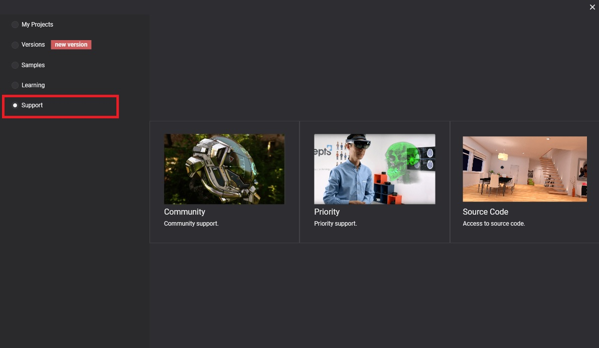

# Samples, Learning and Support

In Evergine launcher you can have access to learning and samples sections to learn more about how to use Evergine and the Support section in the case that you have doubts or need help with something.

## Samples

In this section, you can find an official Evergine sample collection. These samples are stored in GitHub so you can navigate through the collection and click on the _Web_ button to go to sample code in Github.

## Learning

Here you can find the the Official Manual, the API Documentation, and the official Evergine Youtube Channel with useful resources. 

## Support

In this section you can find the **official Evergine support** that includes:
-  Comunity support where you can create a ticket and vote for existing tickets.
- **Priority support Portal** where you can create priority tickets that will be resolve in less to 48 hours for an Evergine team member (only available if you contract _Priorty Support_ service).
- **Access to Evergine Source code** (only available if you contract _Source Code Access_ service).

