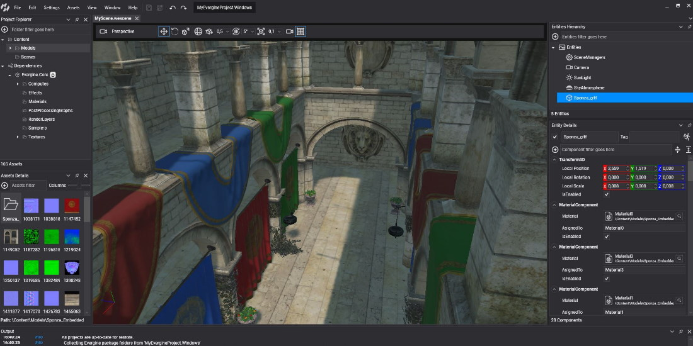

# Get started

---

Welcome to the Official **Evergine** documentation website. Here you will find everything you need to start creating 3D application from scratch.

## In this section

* [Install Evergine](install.md)
* [Create a Project](create_project.md)
* [Open your project in Visual Studio](open_in_vs.md)