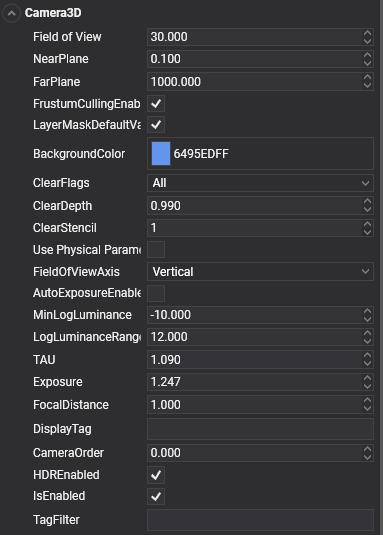

__#Cameras


**Cameras** are responsible to capture your scene and display it to the user. By customizing and manipulating cameras, you can make the visual composition of your scene truly appealing.

You can create an unlimited number of cameras in a **Scene**. They can be set to render in any order, at any place on the screen, and choose the render target destination of this camera.

## Create a Camera3D from code
The following sample code can be used to instantiate a new camera entity in a scene.

```c#
protected override void CreateScene()
{
    // Create a new camera entity.
    Entity cameraEntity = new Entity()
        .AddComponent(new Transform3D())
        .AddComponent(new Camera3D()
        {
            BackgroundColor = Color.CornflowerBlue,
        });

    // Add the camera entity to the entity manager.
    this.Managers.EntityManager.Add(cameraEntity);
}
```


## Create a Camera3D in Evergine Studio
In the Entities Hierarchy panel of your Scene Editor, click the "Add Entity and select **Camera3D**, then choose the kind of camera you want to create:
* **Fixed Camera:** This camera does not have any built-in behaviour, it is static.
* **View Camera:** This camera can be moved using the mouse, touch or keyboard while respecting the look-at point.
* **Free Camera:** This camera can be moved using the mouse, touch or keyboard. 


## Camera3D properties



|Property           | Description |
|--------------------|-------------|
| Field of View | The Camera’s view angle, measured in degrees along the axis specified in the Field of View Axis drop-down.|
| Field of View Axis | Field of view axis: <ul><li>**Vertical:** The camera uses a vertical field of view axis.</li><li>**Horizontal:** The camera uses a horizontal field of view axis.</li></ul> |
| Near Plane | The nearest distance the camera can see.|
| Far Plane | The furthest distance the camera can see.|
| Background Color | The color applied to the background. |
| Clear Flags | This flags indicates wich part of the framebuffer will be cleared before rendering: <ul><li>**Target:** Clear the color buffer attachments.</li><li>**Depth:** Clear the depth buffer attachment.</li><li>**Stencil:** Clear the stencil buffer attachment.</li><li>**All:** Clear all attachments described before.</li></ul>|
| HDR Enabled | Render the camera output in a HDR format |
| Camera Order | Specify the order in which the camera will be rendered. Lower values produces that the camera will be rendered first.|

