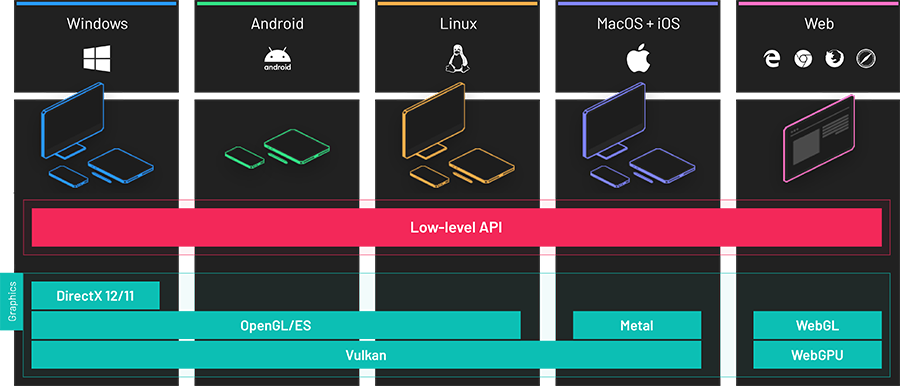

# Low-level API

---

**Evergine** uses a custom low level graphics API to send commands to the GPU. This is a cross-platform agnostic library to run on top of DirectX, Vulkan, OpenGL and Metal. In this section we will take a look to all the classes and objects used by **Evergine** to share data with the GPU.
It is a new graphics API inspired on the latest advances on DirectX 12, Vulkan and Metal to get the maximum graphics performance when using once of this APIs but also with backward compatibility to support APIs like DirectX 11, OpenGL and WebGL.

## In this section

* [ResourceFactory](resourcefactory.md)
* [GraphicsContext](graphicscontext.md)
* [Buffer](buffer.md)
* [Texture](texture.md)
* [Sampler](sampler.md)
* [Swapchain](swapchain.md)
* [Framebuffer](framebuffer.md)
* [Shader](shader.md)
* [ResourceLayout](resourcelayout.md)
* [GraphicsPipeline](graphicspipeline.md)
* [ComputePipeline](computepipeline.md)
* [RayTracingPipeline](raytracingpipeline.md)
* [ResourceSet](resourceset.md)
* [CommandQueue](commandqueue.md)
* [CommandBuffer](commandbuffer.md)
