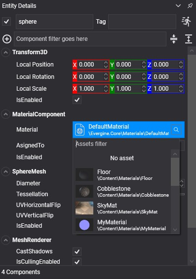

# Using Materials


In this document you will learn how to load and use **Materials** in your applications.

## Load Material from code
The following sample code can be used to instantiate an existing material asset and apply to an entity in your scene.
```csharp
protected override void CreateScene()
{
    var assetsService = Application.Current.Container.Resolve<AssetsService>();

    // Load Material
    Material defaultMaterial = assetsService.Load<Material>(EvergineContent.Materials.DefaultMaterial);

    // Apply to an entity
    Entity primitive = new Entity()
            .AddComponent(new Transform3D())
            .AddComponent(new MaterialComponent() { Material = defaultMaterial })
            .AddComponent(new SphereMesh())
            .AddComponent(new MeshRenderer());

    this.Managers.EntityManager.Add(primitive);
}
```

## How to apply material to an entity from Evergine Studio.

Select an entity from Viewport or Entities Hierarchy and then the Entity Details panel shows the entity component list. To apply a new material set the Material property in the Material Component of your entity.

