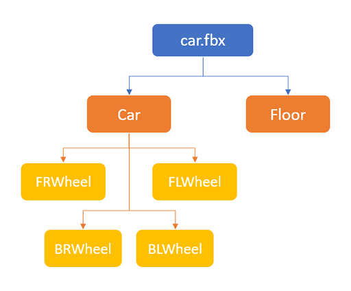
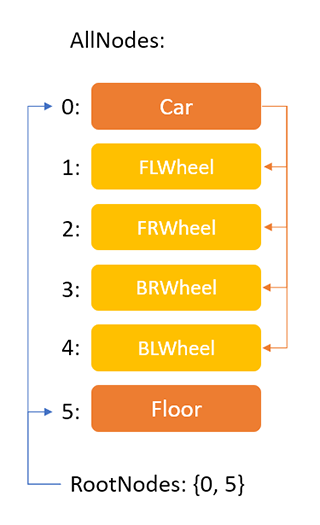

# Models
---

Models are files that contains **3d objects** like characters, objects, and all kind of elements. **Evergine** supports importing models created by 3D editing software (like _3ds Max_, _Blender_ or CAD software like _Solidworks_.) but also supports procedural model generation.

Models are crucial assets in every graphical application because can provide high quality and realism.

In **Evergine** a **Model** is a graphical element that combines multiple parts to conform a full 3D object in a scene.

It can contains the following parts:
- Node Hierarchy.
- MeshContainers
- Material references.
- Skinning information.
- Animation Clips

## Node Hierarchy
A **Model** contains a node graph that covers all the objects of the 3d model. They are covered in the **NodeContent** class. They can have geometry or just serve as dummy element, but all of them contains a transform information (position, orientation and scale) and a list of children.

**Model** contains the hierarchy in these two properties:

| Property | Description |
| -------- | ----------- |
| AllNodes | The list of all the **NodeContents**, whether they are in the root level or not. |
| RootNodes | The indices of the NodeContent elements of the _AllNodes_ list that contains the nodes at root level (they don't have a parent).|

For example, if we have this node hierarchy:

A **Model** would have them stored in this way:

### NodeContent
The **NodeContent** refers to the class that represents one node. It contains the basic information of a node of a 3d model:

| Property | Description | 
|----------|------------ |
| Name | Name of the node |
| Children| Array of the **NdeContent** children of the node.
| Translation | Local Vector3 translation of the node. |
| Orientation | Local Quaternion orientation of the node. |
| Scale | Local Vector3 scale of the node. |
| Mesh | **MeshContainer** reference of the node. That means the node has geometry attached to it. _null_ if the node doesn't have geometry.
| Skin | Reference of a **SkinContent** element, meaning the node is a skinned mesh. _null_ if the node is not skinned.

## MeshesContainers
In a **Model** mesh containers are where the 3d geometry is stored. It usually represents one full object, and it can contains one or more Meshes (see [this section](../meshes.md) for more information.). The main reason for the **MeshContainer** concept is that a geometry attached to a node can contain multiple sub-elements with a different material each of them. One **MeshContainer** can be referenced by one or more nodes, making the model more memory efficient.

| Property | Description |
| -------- | ----------- |
| Name | Name of the mesh container. |
| Skin | Reference of the SkinContent for skinning information (if it's the case). |
| BoundingBox | The Bounding box of the mesh. |
| Meshes | List of the meshes of this container |

## Materials
The model also contain a list of a tuple containing the material id and the material name referenced by its meshes. The **Mesh** class contains a parameter called _MaterialIndex_ which tells us the index of this list we're refering to.

## Skinning Information

**Evergine** supports Skinning animation. With this method a geometry is deformed following the transformations of a set of bones.

 To support it the model class contains an array of **SkinContent** class, that represents the skinning information of a geometry. Every **MeshContainer** and **Node** that as a skinned mesh references one of the elements of the array.

The **SkinContent** class contain this information:

| Property | Description |
| -------- | ----------- |
| Name | Name of the skinning content. |
| Nodes | Array of integer that contain the indices of the AllNodes list of the Model class. They are the bone nodes of the skeleton.
| InverseBindPoses | Array of **Matrix4x4**. For every node of the skeleton there is a matrix in that contains the inverse bind pose relative to its parent. 
| RootJoint | Int that represents the index in the Nodes array of the root bone of the skinning. |

Using this properties animating the nodes referenced by this **SkinContent** will animate the geometry accordingly.

## Animations

In ##Evergine## model animation is achieved by animating nodes. If those nodes are part of a skinning bones, it will also animate the skinned mesh accordingly.

## In this section
* [Import Models](import_model.md)
* [Using Model](using_models.md)
* [How to create a model from code](create_model_from_code.md)
* [Model Editor](model_editor.md)
