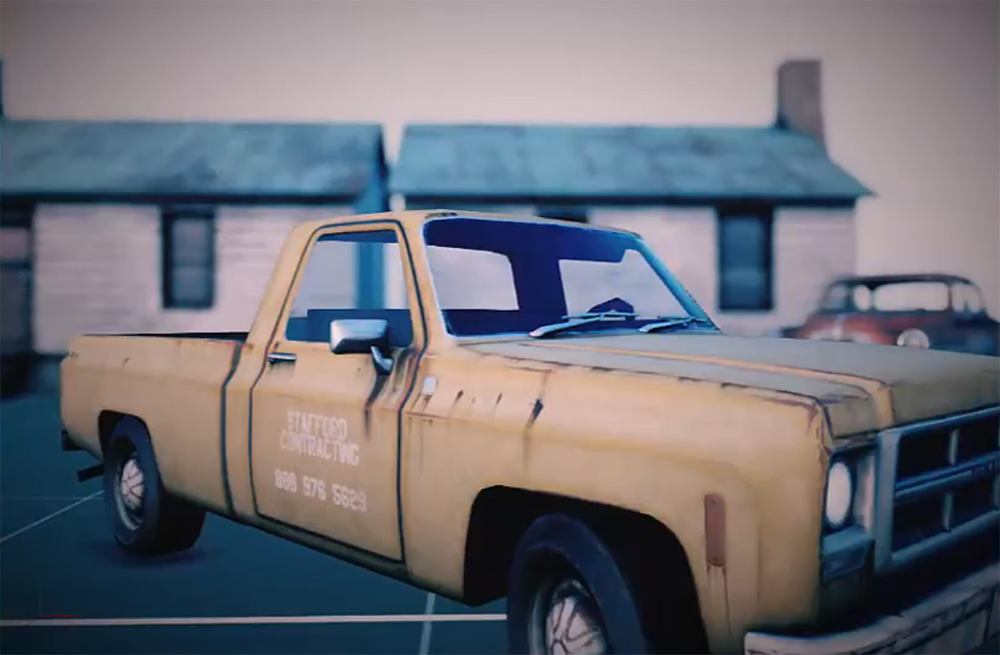

# Depth of Field
---
**Depth of Field** is the distance between the nearest and the farthest objects that are in acceptably sharp focus in an image. The depth of field can be calculated based on focal length, distance to subject, the acceptable circle of confusion size, and aperture. A particular depth of field may be chosen for technical or artistic purposes.

| Parameter  | Description |
| ---------- | ----------- |
| Debug Mode | Mode debug enabled draws red the nearest areas, green the focus areas and blue the farest areas. Only for debug proposes. | 
| Focal Region | Size of the focus area. |
| Bokeh Shape | Shape uses to simulate bokeh effect: _Circle_, _Pentagon_, _Hexagon_, _Heptagon_. |
| Bokeh Size | Size of the bokeh shapes. | 
| Bokeh rotation | Angle of the bokeh shapes. |
| Near Fade Power | Blur border size around the nearest areas.|

> [!Tip]
> The Focal Distance is configured in the camera parameters.