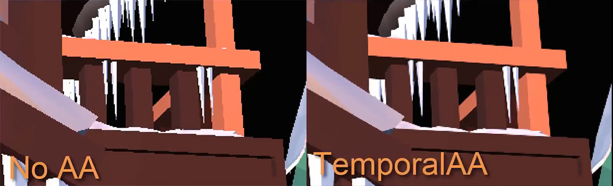

# Temporal Anti-Aliasing
---

**Tempral Anti-Aliasing (TAA)** is a spatial anti-aliasing technique for computer-generated video that combines information from past frames and the current frame to remove jaggies in the current frame. In TAA, each pixel is sampled once per frame but in each frame the sample is at a different location at subpixel level. Pixels sampled in past frames are blended with pixels sampled in the current frame to produce an anti-aliased image. This effect improves the quality of anti-aliasing FXAA result.

This effect doesn't require any setting parameters.

