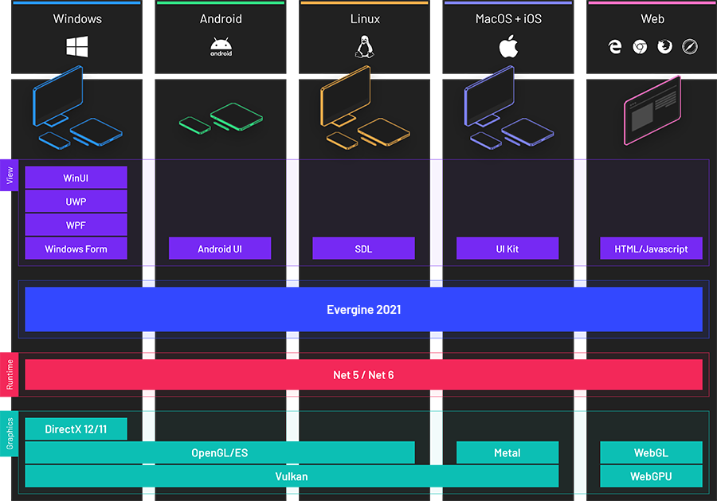

# Supported Graphics Backends
---

**Evergine** supported multiples graphics APIs including DirectX11, DirectX12, Vulkan, OpenGL, Metal and WebGL/WebGPU.

In the previous image you can see and overall diagram where all this APIs are represented.

All the most recent APIs are supported and on top of all of them exists a common [low level graphics API](../low_level_api/index.md) used by **Evergine** to abstract the final graphics API used by the applications.

## In this section

* [DirectX11](directx11.md)
* [DirectX12](directx12.md)
* [OpenGL](opengl.md)
* [Vulkan](vulkan.md)
* [Metal](metal.md)
* [WebGPU](webgpu.md)
