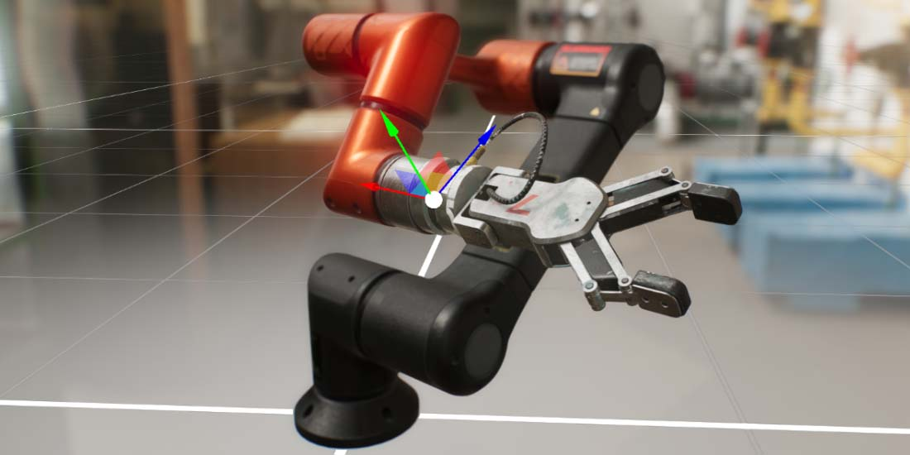

# Evergine manual

---

These pages contain information about how to use Evergine. This manual helps you learn how to use Evergine and its associated tools.
You can read it from start to finish, or use it as a reference

> [!Note]
> This documentation is a work-in-progress and updated regularly with new content. If you find something that can be improved, please contact us in the [feedback repository](https://github.com/evergineteam/Feedback)

## In this section

- [Getting started](get_started/index.md)
- [Evergine Launcher](evergine_launcher/index.md)
- [Evergine Studio](evergine_studio/index.md)
- [Basics](basics/index.md)
- [Graphics](graphics/index.md)
- [Input](input/index.md)
- [Audio](audio/index.md)
- [Animation](animation/index.md)
- [Physics](physics/index.md)
- [XR](xr/index.md)
- [Extensions](extensions/index.md)
