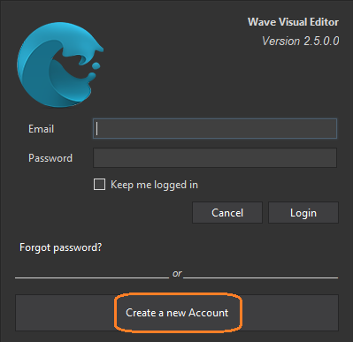
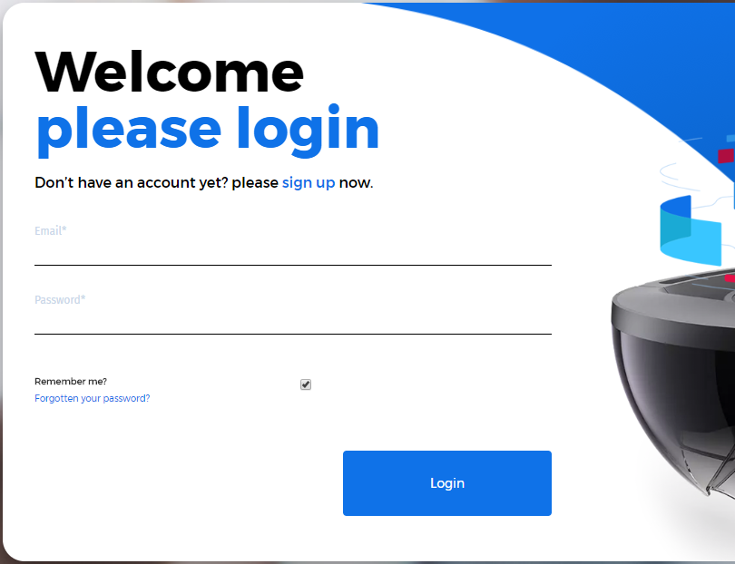

# Create a Wave Engine Account

The first time you open Wave Visual Editor you will be asked for an user account.

If you click on Create a new Account, the browser will take you to the [join form](http://waveengine.net/account/register).

Please, fill such in and click on Submit. You should immediately receive a confirmation e-mail. Congratulations! You can now login into the Editor and proceed with your first application.
