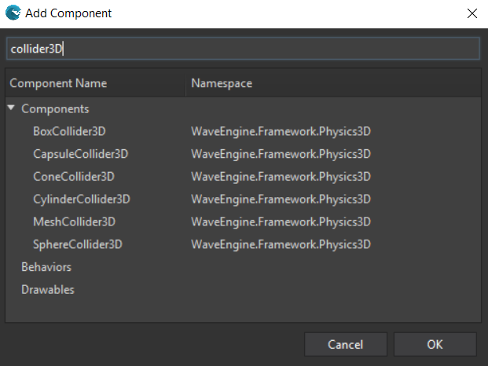

## Goal

To know when two entities collide they need a Rigid Body component to be physical and a Collider component.

## Hands-on

Rigid bodies can be:
* [RigidBody3D](xref:WaveEngine.Framework.Physics3D.RigidBody3D) 
* [StaticBody3D](xref:WaveEngine.Framework.Physics3D.StaticBody3D)

To be able to collide a [Collider3D](xref:WaveEngine.Framework.Physics3D.Collider3D) component must be added too, but there are various types of colliders: 

* [BoxCollider3D](xref:WaveEngine.Framework.Physics3D.BoxCollider3D)
* [CapsuleCollider3D](xref:WaveEngine.Framework.Physics3D.CapsuleCollider3D)
* [ConeCollider3D](xref:WaveEngine.Framework.Physics3D.ConeCollider3D)
* [CylinderCollider3D] (xref:WaveEngine.Framework.Physics3D.CylinderCollider3D)
* [SphereCollider3D](xref:WaveEngine.Framework.Physics3D.SphereCollider3D)
* [MeshCollider3D](xref:WaveEngine.Framework.Physics3D.MeshCollider3D)

Every `Collider3D` requires a [Transform3D](xref:WaveEngine.Framework.Graphics.Transform3D), which handles the position in the 3D world, among other things

### With Visual Studio (for Windows or Mac)

Simply add a [RigidBody3D](xref:WaveEngine.Framework.Physics3D.RigidBody3D) component and the [BoxCollider3D](xref:WaveEngine.Framework.Physics3D.BoxCollider3D) component using the Add Component button in the Entity Details panel:



### With Visual Studio/Xamarin Studio

The entity would be built in the following way:

```c#
var cube = new Entity("cube")
            .AddComponent(new Transform3D())
            .AddComponent(new MaterialComponent())
            .AddComponent(new CubeMesh())
            .AddComponent(new MeshRenderer()) 
			.AddComponent(new RigidBody3D())
            .AddComponent(new BoxCollider3D());
```

Later on, in order to check for intersections, we would simply subscribe to the RigidBody events:
* [BeginCollision](xref:WaveEngine.Framework.Physics3D.PhysicBody3D.BeginCollision)
* [EndCollision](xref:WaveEngine.Framework.Physics3D.PhysicBody3D.EndCollision)
* [UpdateCollision](xref:WaveEngine.Framework.Physics3D.PhysicBody3D.UpdateCollision)

## Wrap-up

This recipe shows how a [Collider3D](xref:WaveEngine.Framework.Physics3D.Collider3D)  component can be easily added to entities, in order to detect collisions between them.