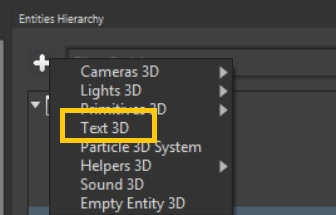
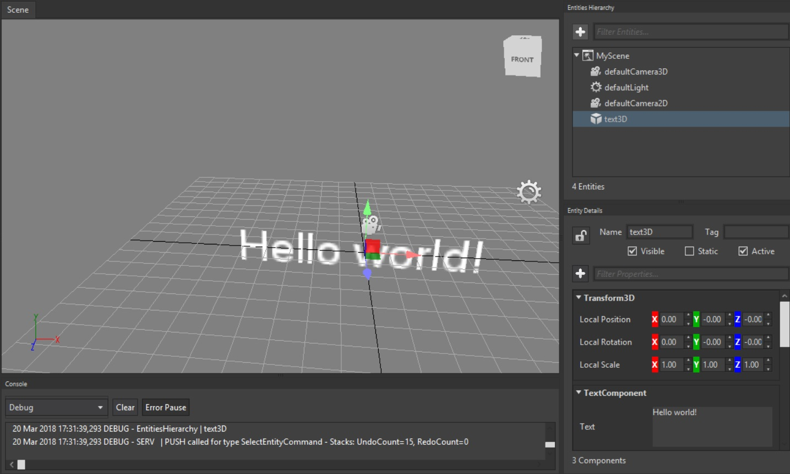

## Goal

There is a component to render texts into a scene. 
On the following paragraphs we will learn how to add text into a 3D context. 

## Hands-on

### With Wave Visual Editor

Set **Wave Editor** on 3D mode, next from the _Entities Hierarchy_ window add a **Text 3D** entity:



You will see the editor rendering the text 



### With Visual Studio (for Windows or Mac)

To get a similar behavior by code just create an entity in this way:

```c#
var text = new Entity()
    .AddComponent(new Transform3D())
    .AddComponent(new TextComponent() { Text = "Hello world!" })
    .AddComponent(new TextRenderer3D());

EntityManager.Add(text);

```


## Wrap-up

You have learned how to add text in a 3D context.