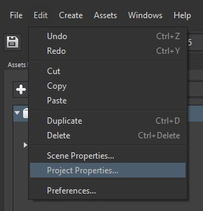
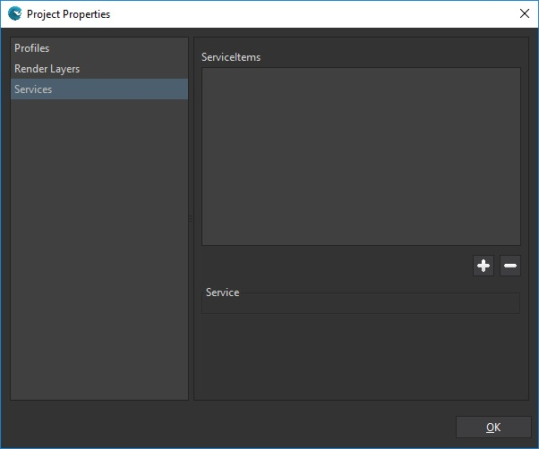
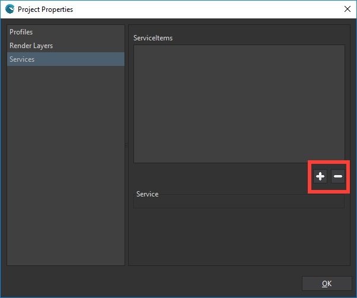
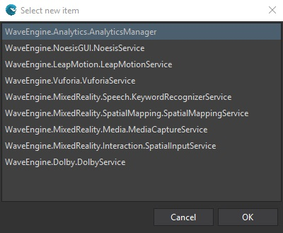

## Goal

Within this recipe you will learn how to develop and use a Wave Service in your games.

## Hands-on

### With Wave Visual Editor

On an empty project, open the scene properties:



In *Project Properties* panel, select *Services* from property list

In *services* subpanel, you can see that **serviceItems** within the current scene are empty by now.



Wave Engine provides a default set of services to help you creating features for your game.
Now you can add or remove services to scene using the **plus** and **minus** buttons.





Some of those services will need configuration in order to work properly, but you can configure from the same panel.

### With Visual Studio (for Windows or Mac)

Open or create a WaveEngine project in Wave Visual Editor.

## Create a new Service

Create a new Class in your project and name it **MynewService** and add WaveEngine.Common reference to use the **Service** class or **UpdatableService** if you need code in **Update** method.

```c#
using WaveEngine.Common;
```

Extends the class with the Class Service or UpdatableService and implements its abstract methods (when required)

```c#
public class MyNewService : Service
{
}
```

or

```c#
public class MyNewService : UpdatableService
{
    public override void Update(TimeSpan gameTime)
    {
        throw new NotImplementedException();
    }
}
```

## Register a Service

You must to register your service before using it:

```c#
WaveServices.RegisterService(new MyNewService());
```

## Get a Service

If you have to get any service you can use its type using the **WaveServices.GetService** method

```c#
WaveServices.GetService<MyNewService>();
```

## Unregister a Service

If you don't need the service more you can unregister it:

```c#
WaveServices.UnregisterService<MyNewService>();
```

or using the instance (**myservice** is the name of the instance for the **MyNewservice** user Service):

```c#
WaveServices.UnregisterService(myservice);
```

## Wrap-up

You have learned how to create, register, unregister and get a service in your games.